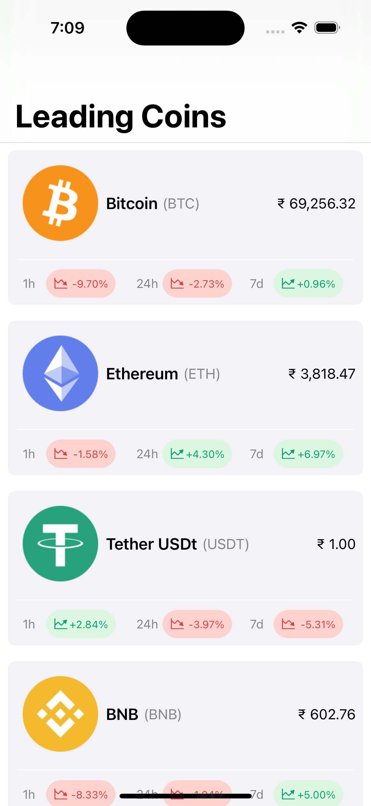
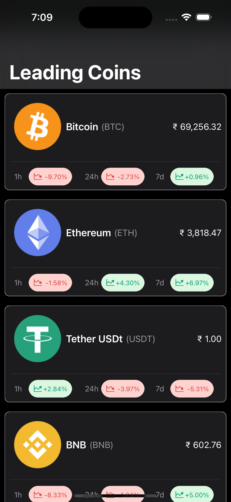
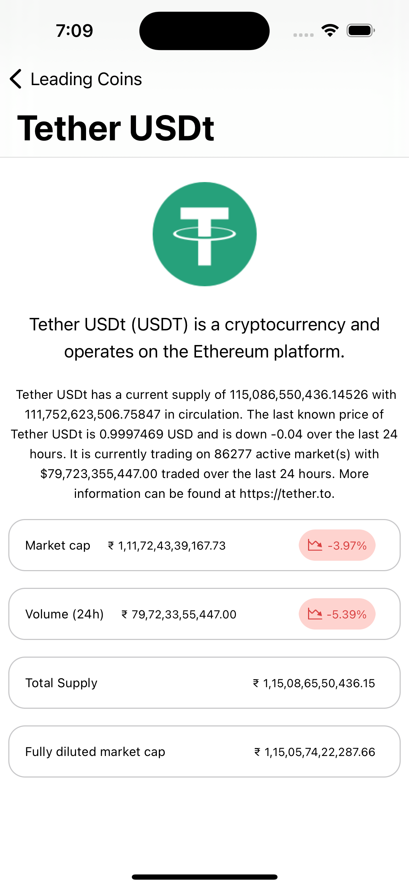
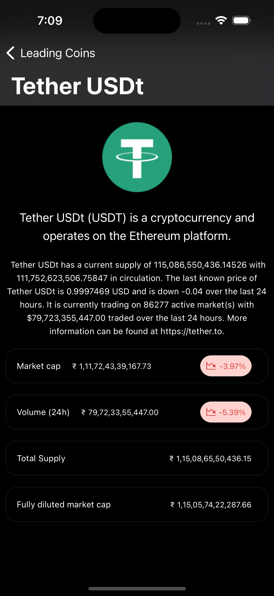

# CryptoAssetTracker
Sample Swift 5 application utilizing the Combine framework and MVVM, to fetch and display data from CoinMarketCap API

## Getting Started
- Copy and Clone the project.
- Run and build.

## NOTICE
### You will need to provide your  [CoinMarketCap APIKey](https://pro.coinmarketcap.com/signup/) and replace the value [here](https://github.com/megaganjotsingh/CryptoAssetTracker/blob/3222ee7fecce106fa7a5c4fa0c5870029441f80e/CryptoAssetTracker/Util/Constants.swift#L10)

### Screenshots
Home(Light) |  Home(Dark) |  Details(Light) | Details(Dark)
:-------------------------:|:-------------------------:|:-------------------------:|:-------------------------:
  |     |    |    

### Libraries/Frameworks Used
* [UIKit](https://developer.apple.com/documentation/uikit)
* [UICollectionViewCompositionalLayout](https://developer.apple.com/documentation/uikit/uicollectionviewcompositionallayout)
* [Combine](https://developer.apple.com/documentation/combine)
* [Kingfisher](https://github.com/onevcat/Kingfisher)

### Project Requirements
* iOS 13.0+
* Xcode 14+
* Swift 5.0+
